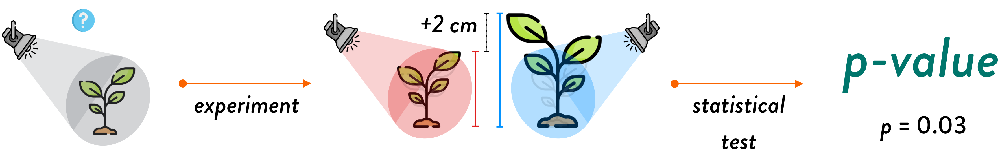
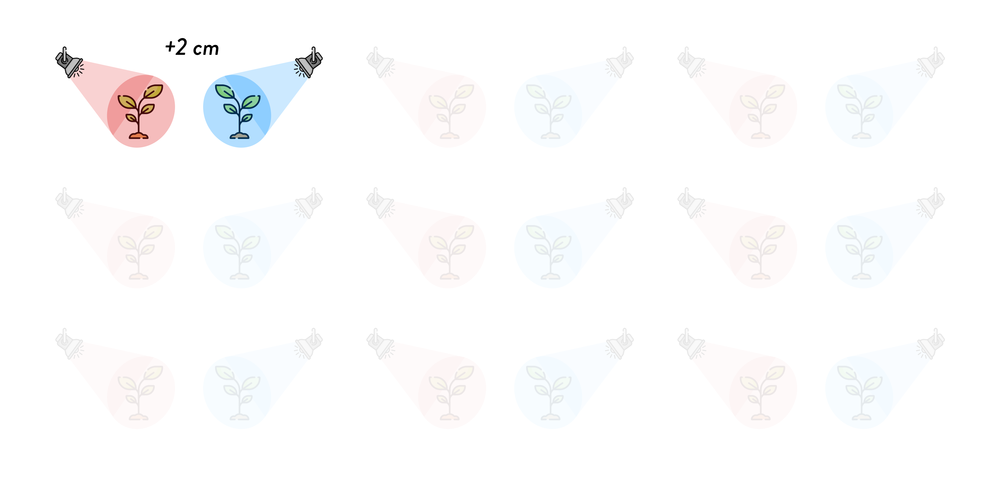
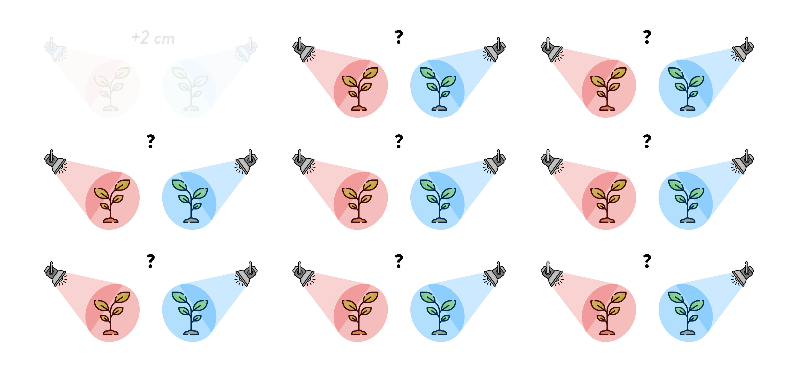
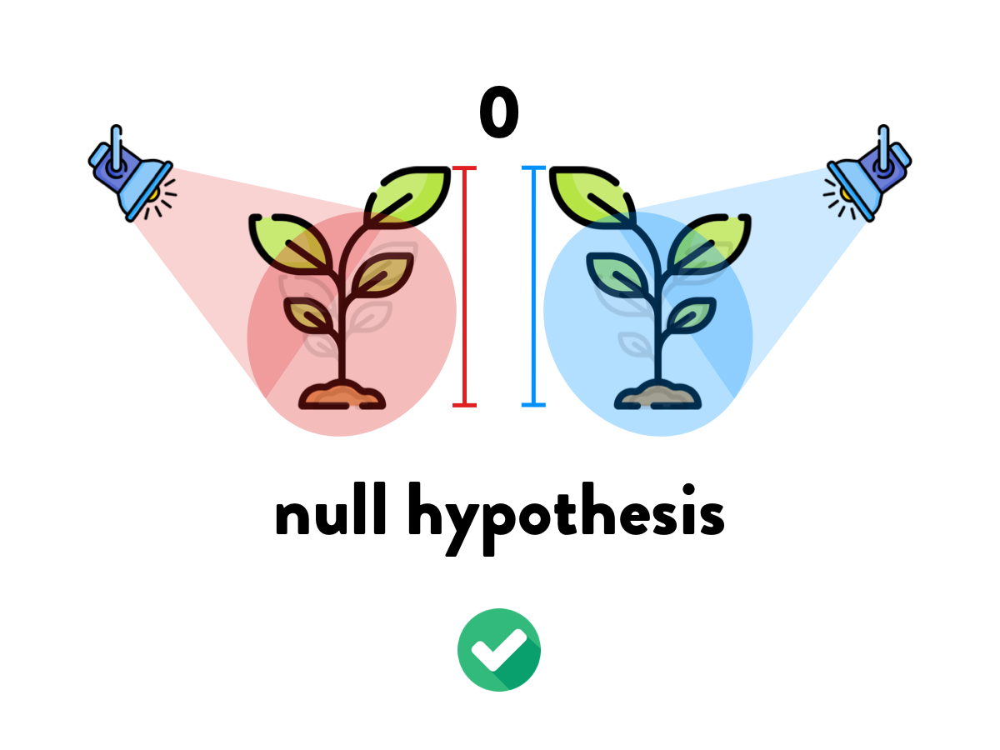
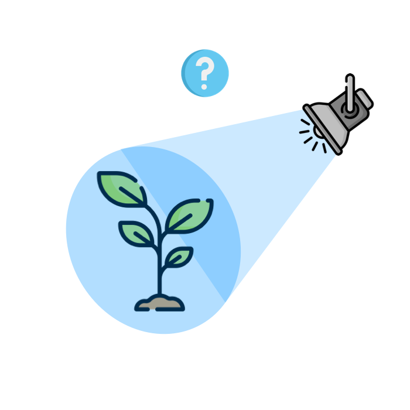

```{r setup, include=FALSE}
knitr::opts_chunk$set(echo = FALSE)
options(htmltools.dir.version = FALSE)
library(tidyverse)
theme_set(theme_minimal())
```

```{r xaringanExtra, echo=FALSE}
xaringanExtra::use_xaringan_extra(c("tachyons"))
```

# From research question to p-value

<br>

.center[]

???

Let's imagine we want to move to Mars and grow plants to sustain our life there.

Given the predominant colour of Mars, we wonder whether the light of the planet will have an effect on plant growth.

---

# From research question to p-value

<br>

<br>

<br>


???

So we want to know if the colour of the light a plant is exposed to has an effect on the rate of growth of the plant.

---

# From research question to p-value

<br>

<br>

<br>


???

To find that out, we run an experiment: a group of plants is exposed to red light (similar to the light on Mars) and another group is exposed to blue light (similar to the light on Earth).

---

# From research question to p-value

<br>

<br>

<br>


???

After a month, we measure the height of the plants in the two groups and we find that the plants exposed to the blue light are on average 2 cm taller than the plants exposed to the red light.

---

# From research question to p-value

<br>

<br>

<br>



???

We run a statistical test which returns a *p*-value. More precisely, $p = 0.03$.

But what does the *p*-value mean?

---

class: center middle



???

Let's step back a moment.

In this experiment we got a result of +2 cm (plants exposed to blue light were 2 cm taller than plants exposed to red light).

But this is just ONE experiment of infinite number of possible experiments.

---

class: center middle



???

We want to know whether the result we observed in this one experiment would be observed again if we ran many more identical experiments.

---

class: center middle


???

We want to know this because it is possible that, although we observed a difference of +2 cm in THIS experiment, we might have observed no difference (i.e. difference = 0 cm) in any OTHER repetition of the experiment.

And we don't want this to happen! (We don't want to find a difference of +2 cm while in fact there is no difference)

So this is what we do.

---

class: center middle



???

We assume that there is in fact no difference (i.e. colour of light does NOT affect plant growth).

This is called the NULL HYPOTHESIS and we assume that it is true.

---

class: center middle

```{r null-probs, fig.width=13, fig.height=7, dpi=600, fig.retina=TRUE}
x <- seq(-4, 4, by = 0.01)
y <- dnorm(x)

labels <- tibble(
  x = c(0,  -2.5, 2),
  y = c(-0.025, 0.36, 0.1),
  labs = c("0", "high probability", "low probability")
)

arrows <- tibble(
  x1 = c(-1.5, 2.5),
  y1 = c(0.4 - 0.025, 0.1 - 0.025),
  x2 = c(-0.4, 3),
  y2 = c(0.4 - 0.015, 0.025)
)

ggplot() +
  aes(x, y) +
  geom_ribbon(aes(ymin = 0, ymax = y), fill = "#7570b3", alpha = 0.4) +
  geom_segment(aes(x = 0, y = 0, xend = 0, yend = max(y)), colour = "#1b9e77", size = 3) +
  geom_text(data = labels, aes(x, y, label = labs), size = 15, family = "Brandon Grotesque Medium") +
  geom_curve(
    data = arrows, aes(x = x1, y = y1, xend = x2, yend = y2),
    arrow = arrow(length = unit(0.3, "inch"), type = "closed"), size = 1,
    color = "gray20", curvature = -0.3
  ) +
  theme_void()
```

???

If the null hypothesis is true, then we can expect that observing no difference between plants exposed to red or blue light is very probable, i.e. observing no difference has high probability.

On the other hand, observing differences that are further away from 0 is very unlikely (it has very low probability of occurring).

---

class: center middle

```{r rare-events, fig.width=13, fig.height=7, dpi=600, fig.retina=TRUE}
x <- seq(-4, 4, by = 0.01)
y <- dnorm(x)

labels <- tibble(
  x = c(0, 2, -2.5, 3),
  y = c(-0.025, -0.025, 0.36, 0.15),
  labs = c("0", "<- smaller ---- bigger ->", "high probability", "RARE\nEVENT")
)

arrows <- tibble(
  x1 = c(-1.5, 3),
  y1 = c(0.4 - 0.025, 0.1 - 0.025),
  x2 = c(-0.4, 3),
  y2 = c(0.4 - 0.015, 0.025)
)

ggplot() +
  aes(x, y) +
  geom_ribbon(aes(ymin = 0, ymax = y), fill = "#7570b3", alpha = 0.4) +
  geom_segment(aes(x = 0, y = 0, xend = 0, yend = max(y)), colour = "#1b9e77", size = 3) +
  geom_text(data = labels, aes(x, y, label = labs), size = c(15, 11, 15, 16), family = "Brandon Grotesque Medium", colour = c("black", "#d95f02", "black", "#d95f02")) +
  geom_curve(
    data = arrows, aes(x = x1, y = y1, xend = x2, yend = y2),
    arrow = arrow(length = unit(0.3, "inch"), type = "closed"), size = 1,
    color = c("gray20", "#d95f02"), curvature = -0.3
  ) +
  theme_void()
```

???

In other words, if it is true that there is no difference in growth between plants exposed to red light and those exposed to blue light, then observing big differences should be a rare event.

Now, the $p$-value is the probability of finding a certain difference or an even bigger difference even though there is in fact no difference between groups (i.e. when assuming the null hypothesis is true).

---

class: center middle

```{r p-value, fig.width=13, fig.height=7, dpi=600, fig.retina=TRUE}
x <- seq(-4, 4, by = 0.01)
y <- dnorm(x)

labels <- tibble(
  x = c(0, qnorm(0.03, lower.tail = FALSE), 3),
  y = c(-0.025, -0.025, 0.1),
  labs = c("0", "+2cm", "p = 0.03")
)

arrows <- tibble(
  x1 = c(3),
  y1 = c(0.1 - 0.025),
  x2 = c(2.1),
  y2 = c(0.02)
)

ggplot() +
  aes(x, y) +
  geom_ribbon(aes(ymin = 0, ymax = y), fill = "#7570b3", alpha = 0.4) +
  geom_ribbon(aes(x = ifelse(x >= qnorm(0.03, lower.tail = FALSE), x, NA), ymin = 0, ymax = y), fill = "#1b9e77", alpha = 0.7) +
  geom_text(data = labels, aes(x, y, label = labs), size = c(15, 15, 16), family = "Brandon Grotesque Medium", colour = c("black", "black", "#d95f02")) +
  geom_curve(
    data = arrows, aes(x = x1, y = y1, xend = x2, yend = y2),
    arrow = arrow(length = unit(0.3, "inch"), type = "closed"), size = 1,
    color = c("#d95f02"), curvature = -0.3
  ) +
  annotate("point", x = qnorm(0.03, lower.tail = FALSE), y = 0, size = 8) +
  theme_void()
```


???

In our plant experiment, we observed a 2 cm increase in plant growth if the light was blue.

The $p$-value was 0.03.

This means that, assuming that in fact there is no difference, the probability of finding a difference of +2 cm or a bigger difference is 0.03.

---

class: center middle

```{r p-value-2, fig.width=13, fig.height=7, dpi=600, fig.retina=TRUE}
x <- seq(-4, 4, by = 0.01)
y <- dnorm(x)

labels <- tibble(
  x = c(0, qnorm(0.03, lower.tail = FALSE), 3),
  y = c(-0.025, -0.025, 0.1),
  labs = c("0", "+2cm", "p = 0.03")
)

arrows <- tibble(
  x1 = c(3),
  y1 = c(0.1 - 0.025),
  x2 = c(2.1),
  y2 = c(0.02)
)

ggplot() +
  aes(x, y) +
  geom_ribbon(aes(ymin = 0, ymax = y), fill = "#7570b3", alpha = 0.4) +
  geom_ribbon(aes(x = ifelse(x >= qnorm(0.03, lower.tail = FALSE), x, NA), ymin = 0, ymax = y), fill = "#1b9e77", alpha = 0.7) +
  geom_text(data = labels, aes(x, y, label = labs), size = c(15, 15, 16), family = "Brandon Grotesque Medium", colour = c("black", "black", "#d95f02")) +
  geom_curve(
    data = arrows, aes(x = x1, y = y1, xend = x2, yend = y2),
    arrow = arrow(length = unit(0.3, "inch"), type = "closed"), size = 1,
    color = c("#d95f02"), curvature = -0.3
  ) +
  annotate("point", x = qnorm(0.03, lower.tail = FALSE), y = 0, size = 8) +
  annotate("text", x = 2.5, y = 0.35, label = "p-value = The probability of finding a certain difference,\nor a bigger difference,\nassuming that there is no difference", size = 5) +
  theme_void()
```

???

In other words, observing a +2 cm difference or a bigger difference has 3% probability of occurring if the null hypothesis is true.

---

class: center middle



???

So, do we need to install blue lights in green houses on Mars?

In our next class we will see how to use the p-value to make up our minds!
