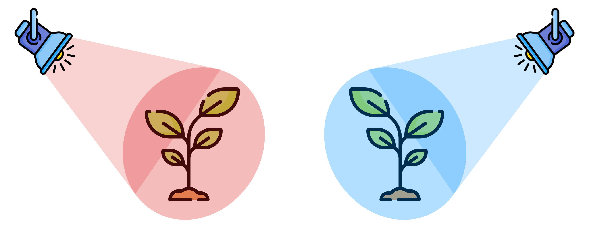

```{r setup, include=FALSE}
options(htmltools.dir.version = FALSE)
```

```{r xaringanExtra, echo=FALSE}
xaringanExtra::use_xaringan_extra(c("tachyons"))
```

# Research question

.center[]

---
class: center middle

# Does light colour affect plant growth?



---

# The Null and the Alternative


---
class: center middle

# Light colour does NOT affect plant growth.


---
class: center middle

# Light colour DOES affect plant growth.


---

# The Null and the Alternative

.pull-left[
.f1[.center[$$H_0$$]]

.center[NULL]

$$growth_{red} = growth_{blue}$$
]

.pull-left[
.f1[.center[$$H_A$$]]

.center[ALTERNATIVE]

$$growth_{red} \neq growth_{blue}$$
]
