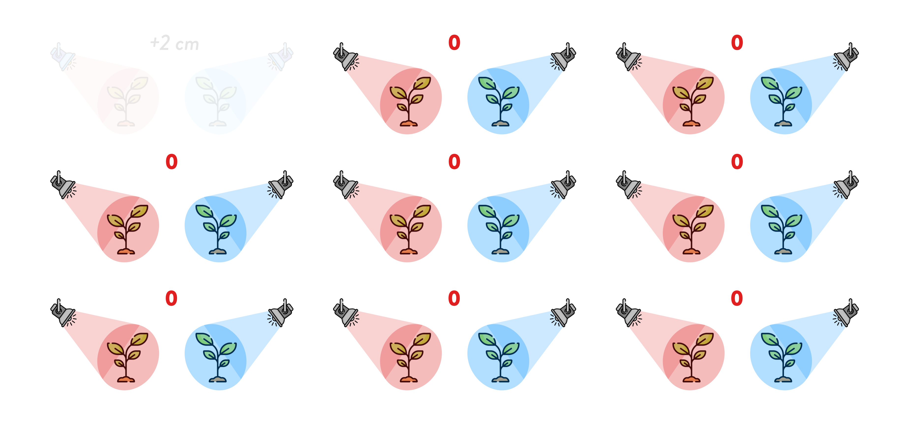

```{r setup, include=FALSE}
knitr::opts_chunk$set(echo = FALSE)
options(htmltools.dir.version = FALSE)
library(tidyverse)
theme_set(theme_minimal())
```

```{r xaringanExtra, echo=FALSE}
xaringanExtra::use_xaringan_extra(c("tachyons"))
```

class: center middle


???

We wanted to know if the colour of a light a plant is exposed too has an effect on the rate of growth of the plant.

So we ran an experiment: a group of plants were exposed to red light and another group was exposed to blue light.

After a month, we measured the height of the plants in the two groups and we found that the plants exposed to the blue light are on average 2 cm taller than the plants exposed to the red light.

We then ran a statistical test which returned a *p*-value ($p = 0.048$)

What does the *p*-value mean?

---

class: center middle


???

Let's step back a moment.

In this experiment we got a result of +2cm.

But this is just ONE experiment.

---

class: center middle


???

So, now we want to know whether the result we observed in this experiment would be observed again if we ran many more identical experiments (say, 100 experiments more).

---

class: center middle



???

We want to know that because it is possible that we got +2cm in this experiment, but we could get 0 in any other repetition of the experiment.

And we don't want this to happen! (That we find a difference of 2cm while in reality there is no difference)

---

class: center middle


???

So what we do is, we assume that in reality there is no difference (i.e. colour of light does NOT affect plant growth).

---

class: center middle

```{r fig.width=13, fig.height=7}
x <- seq(-4, 4, by = 0.01)
y <- dnorm(x)

labels <- tibble(
  x = c(0, -2.5, 2),
  y = c(-0.025, 0.36, 0.1),
  labs = c("0", "high probability", "low probability")
)

arrows <- tibble(
  x1 = c(-1.5, 2.5),
  y1 = c(0.4 - 0.025, 0.1 - 0.025),
  x2 = c(-0.4, 3),
  y2 = c(0.4 - 0.015, 0.025)
)

ggplot() +
  aes(x, y) +
  geom_ribbon(aes(ymin = 0, ymax = y), fill = "#7570b3", alpha = 0.4) +
  geom_segment(aes(x = 0, y = 0, xend = 0, yend = max(y)), colour = "#1b9e77", size = 3) +
  geom_text(data = labels, aes(x, y, label = labs), size = 15, family = "Brandon Grotesque Medium") +
  geom_curve(
    data = arrows, aes(x = x1, y = y1, xend = x2, yend = y2),
    arrow = arrow(length = unit(0.3, "inch"), type = "closed"), size = 1,
    color = "gray20", curvature = -0.3
  ) +
  theme_void()
```

---

class: center middle

```{r fig.width=13, fig.height=7}
x <- seq(-4, 4, by = 0.01)
y <- dnorm(x)

labels <- tibble(
  x = c(0, -2.5, 3),
  y = c(-0.025, 0.36, 0.15),
  labs = c("0", "high probability", "RARE\nEVENTS")
)

arrows <- tibble(
  x1 = c(-1.5, 3),
  y1 = c(0.4 - 0.025, 0.1 - 0.025),
  x2 = c(-0.4, 3),
  y2 = c(0.4 - 0.015, 0.025)
)

ggplot() +
  aes(x, y) +
  geom_ribbon(aes(ymin = 0, ymax = y), fill = "#7570b3", alpha = 0.4) +
  geom_segment(aes(x = 0, y = 0, xend = 0, yend = max(y)), colour = "#1b9e77", size = 3) +
  geom_text(data = labels, aes(x, y, label = labs), size = c(15, 15, 16), family = "Brandon Grotesque Medium", colour = c("black", "black", "#d95f02")) +
  geom_curve(
    data = arrows, aes(x = x1, y = y1, xend = x2, yend = y2),
    arrow = arrow(length = unit(0.3, "inch"), type = "closed"), size = 1,
    color = c("gray20", "#d95f02"), curvature = -0.3
  ) +
  theme_void()
```

